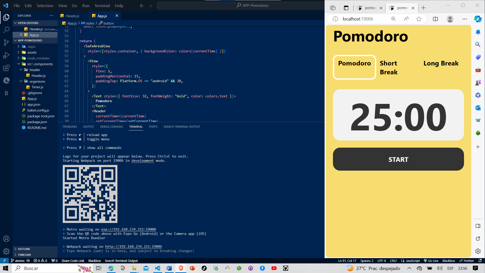

 # APP-Pomodoro
<svg xmlns="http://www.w3.org/2000/svg" xmlns:xlink="http://www.w3.org/1999/xlink" width="173.75" height="28" role="img" aria-label="STATUS: COMPLETED"><title>STATUS: COMPLETED</title><g shape-rendering="crispEdges"><rect width="71.5" height="28" fill="#555"/><rect x="71.5" width="102.25" height="28" fill="#e05d44"/></g><g fill="#fff" text-anchor="middle" font-family="Verdana,Geneva,DejaVu Sans,sans-serif" text-rendering="geometricPrecision" font-size="100"><text transform="scale(.1)" x="357.5" y="175" textLength="475" fill="#fff">STATUS</text><text transform="scale(.1)" x="1226.25" y="175" textLength="782.5" fill="#fff" font-weight="bold">COMPLETED</text></g></svg>

This simple application is an excellent option to manage the time of your tasks, in a period of time it allows you to work continuously until the time is up, then it will send you a message that it is finished

## App_preview --
## --In this section we work on the application code and test it through the web

## --After everything was perfect, we continued to test it on the mobile device through Expo Go.

# contributors

# --Nombres y Matriculas

## -Jonathan Joel cepeda 2021-0373
## -Jose Daniel 2019-0974